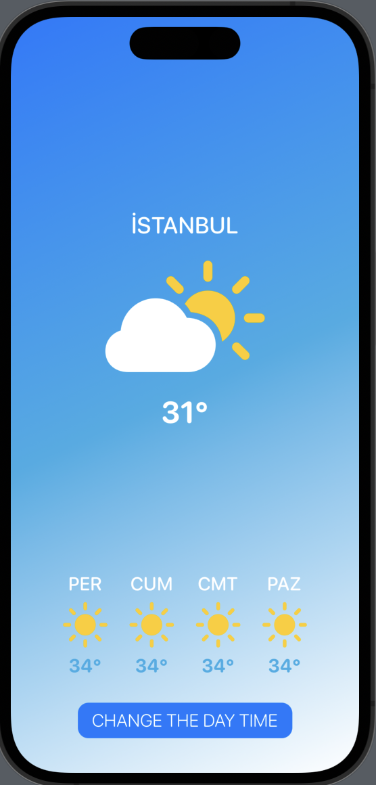
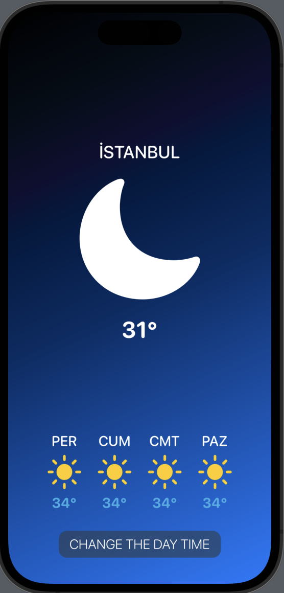

# weather-swift
### A SwiftUI Experiment.

  This is made with using only stacks to test the preview function of XCode. 
  Its sole functionality is to change the theme of the UI.

### Screenshots

